# summary

*commonly solved instances* (**c.s.i.**):
- **c.s.i.** are the subset of benchmarking instances (i.e., scenarios including computational repetitions) that were successfully scheduled by all schedulers of the current comparison

## all

|uc|mcs|mct|strict|stricter|
|:---:|:---:|:---:|:---:|:---:|
|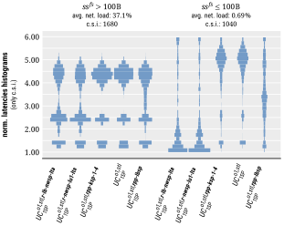||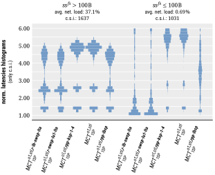|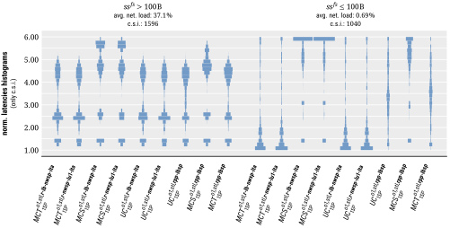|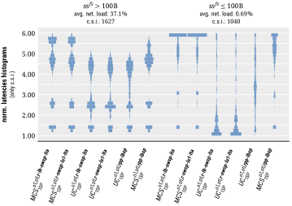|
|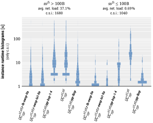|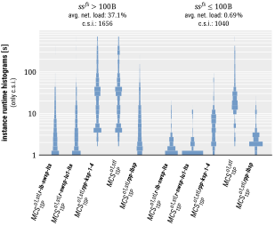|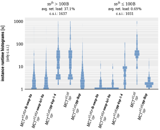|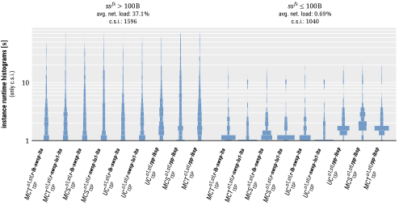|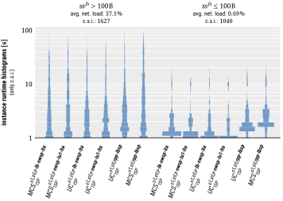|
|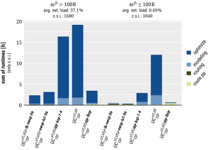|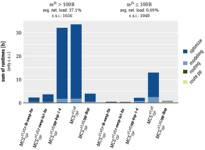|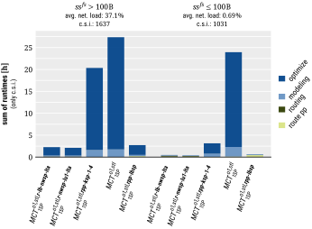|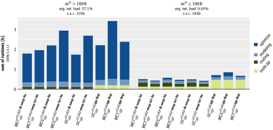|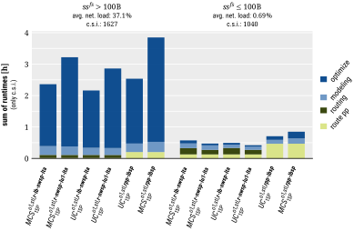|
|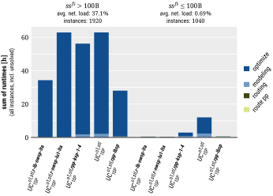||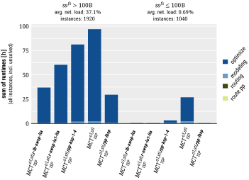|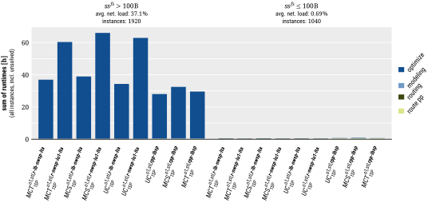|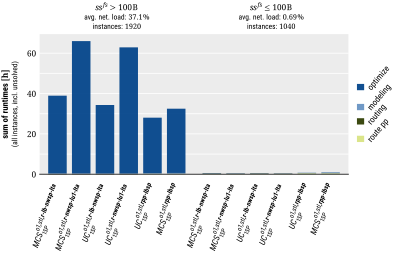|
|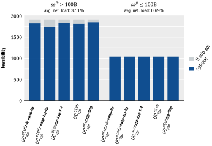||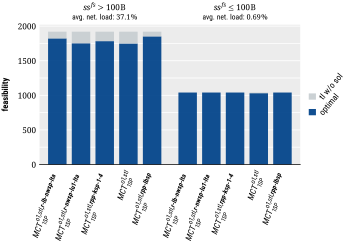|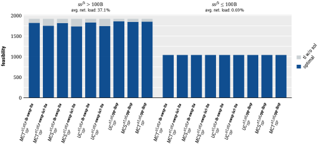|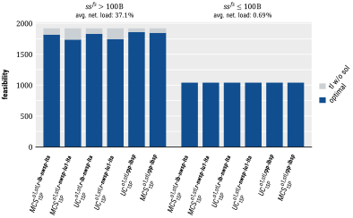|

## hi

|uc|mcs|mct|strict|stricter|
|:---:|:---:|:---:|:---:|:---:|
|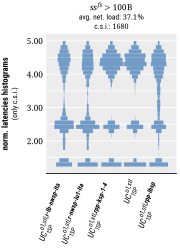|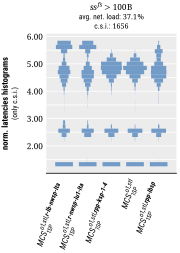|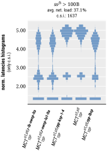|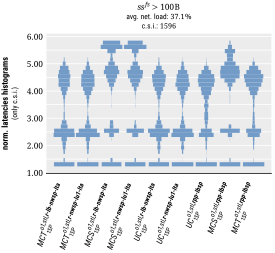|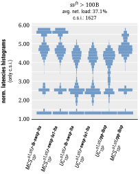|
|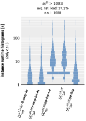|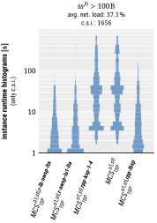|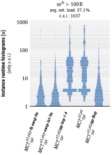|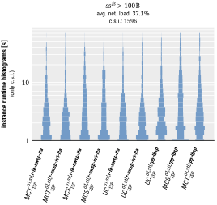|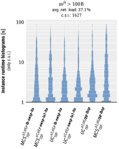|
|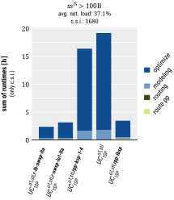|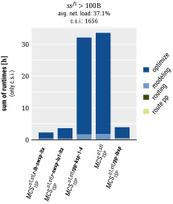|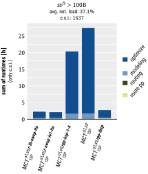|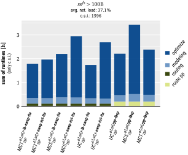|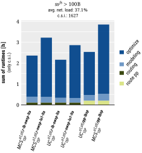|
|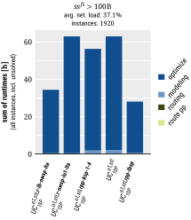|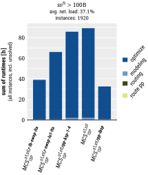|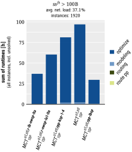|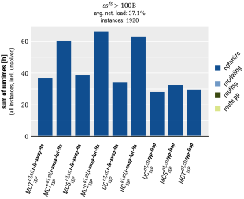|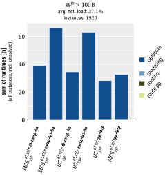|
|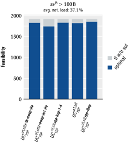|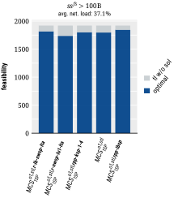|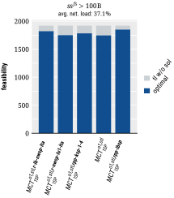||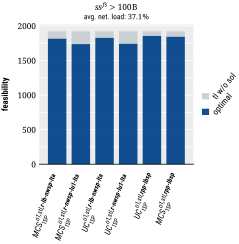|

## lo

|uc|mcs|mct|strict|stricter|
|:---:|:---:|:---:|:---:|:---:|
|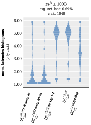|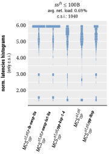|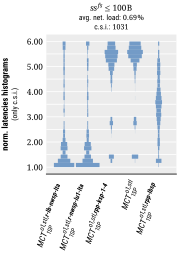|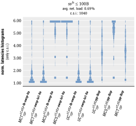||
||||||
||||||
||||||
||||||

