# summary

*commonly solved instances* (**c.s.i.**):
- **c.s.i.** are the subset of benchmarking instances (i.e., scenarios including computational repetitions) that were successfully scheduled by all schedulers of the current comparison

## all

|nonopt|1sp|opt|splt|
|:---:|:---:|:---:|:---:|
|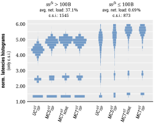|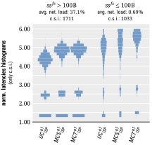|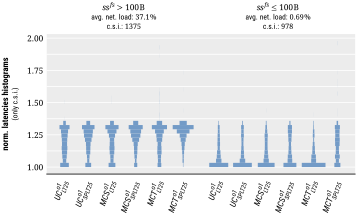|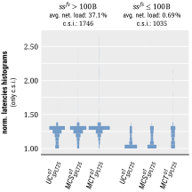|
|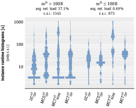|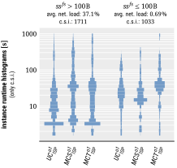|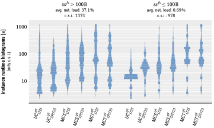|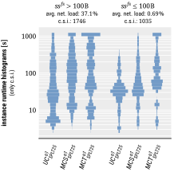|
|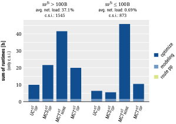|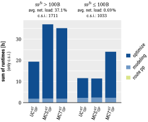|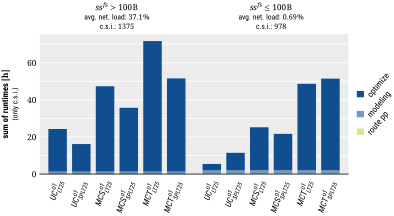|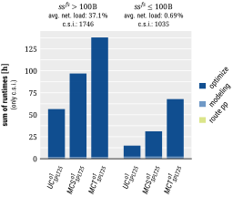|
|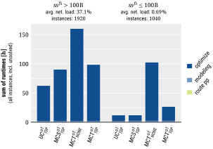|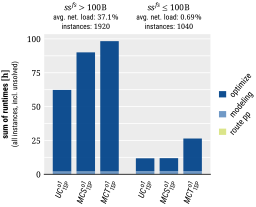|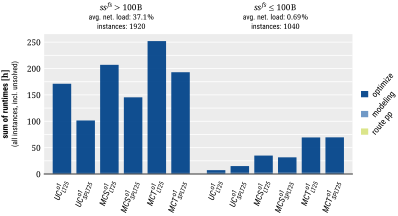|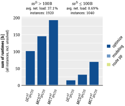|
|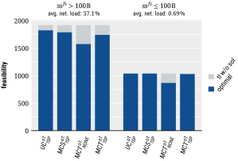|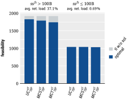|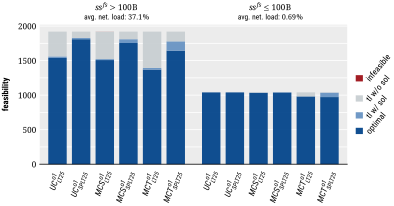|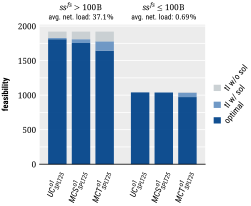|

## hi

|nonopt|1sp|opt|splt|
|:---:|:---:|:---:|:---:|
|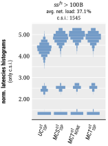|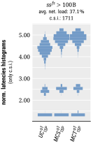|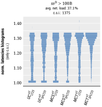|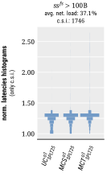|
|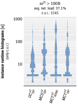||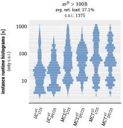|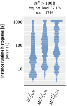|
|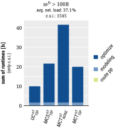|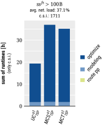|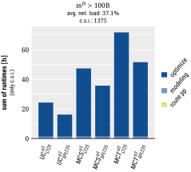|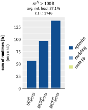|
|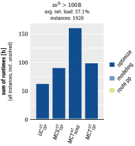|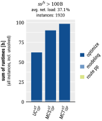|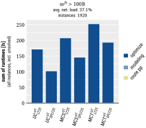|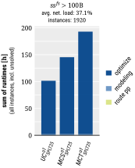|
|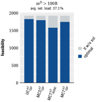|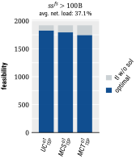|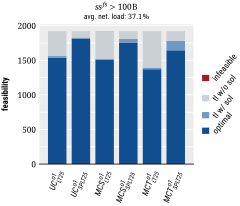|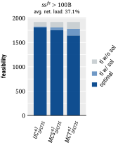|

## lo

|nonopt|1sp|opt|splt|
|:---:|:---:|:---:|:---:|
|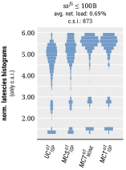|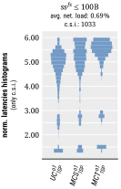|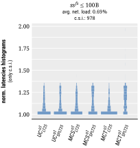|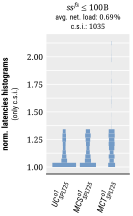|
|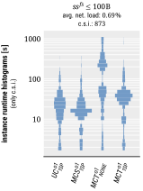|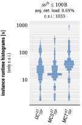|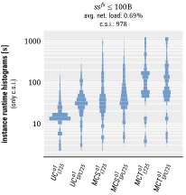||
|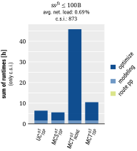|||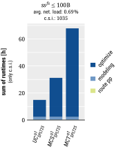|
|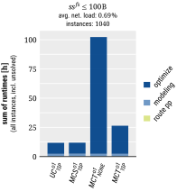|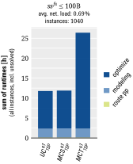|||
|||||

