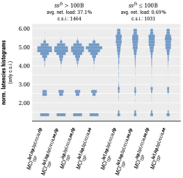

# summary

*commonly solved instances* (**c.s.i.**):
- **c.s.i.** are the subset of benchmarking instances (i.e., scenarios including computational repetitions) that were successfully scheduled by all schedulers of the current comparison

## all

|mci_1sp|mct_1sp|mci_vs_mct|
|:---:|:---:|:---:|
||||
||||
||||
||||
||||

## hi

|mci_1sp|mct_1sp|mci_vs_mct|
|:---:|:---:|:---:|
||||
||||
||||
||||
||||

## lo

|mci_1sp|mct_1sp|mci_vs_mct|
|:---:|:---:|:---:|
||||
||||
||||
||||
||||

