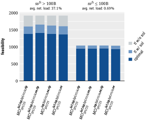
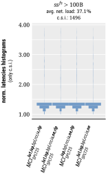
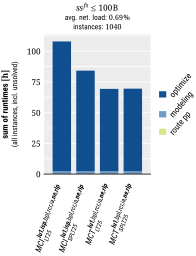

# summary

*commonly solved instances* (**c.s.i.**):
- **c.s.i.** are the subset of benchmarking instances (i.e., scenarios including computational repetitions) that were successfully scheduled by all schedulers of the current comparison

## all

|mci_lt|mci_splt|mct_lt|mct_splt|mci_vs_mct|
|:---:|:---:|:---:|:---:|:---:|
||||||
||||||
||||||
||||||
||||||

## hi

|mci_lt|mci_splt|mct_lt|mct_splt|mci_vs_mct|
|:---:|:---:|:---:|:---:|:---:|
||||||
||||||
||||||
||||||
||||||

## lo

|mci_lt|mci_splt|mct_lt|mct_splt|mci_vs_mct|
|:---:|:---:|:---:|:---:|:---:|
||||||
||||||
||||||
||||||
||||||

