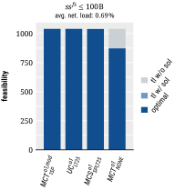

# summary

*commonly solved instances* (**c.s.i.**):
- **c.s.i.** are the subset of benchmarking instances (i.e., scenarios including computational repetitions) that were successfully scheduled by all schedulers of the current comparison

## all

|nt1x6t|
|:---:|
||
||
||
||
||

## hi

|nt1x6t|
|:---:|
||
||
||
||
||

## lo

|nt1x6t|
|:---:|
||
||
||
||
||

