# summary

*commonly solved instances* (**c.s.i.**):
- **c.s.i.** are the subset of benchmarking instances (i.e., scenarios including computational repetitions) that were successfully scheduled by all schedulers of the current comparison

## all

|t_uc|t_mcs|t_mct_none|t_mct_1sp|i_3t|i_4t|
|:---:|:---:|:---:|:---:|:---:|:---:|
|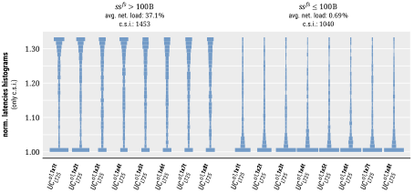|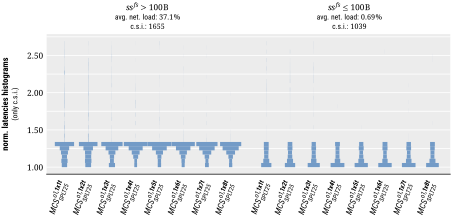||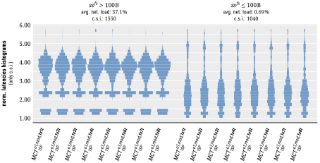|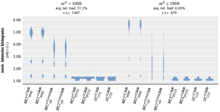|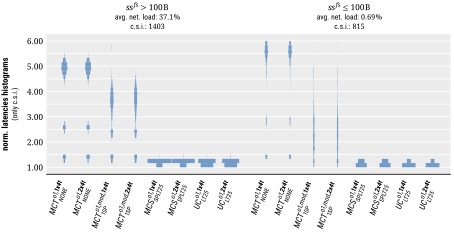|
|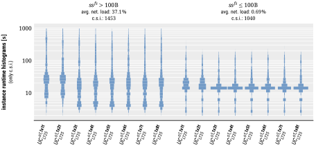|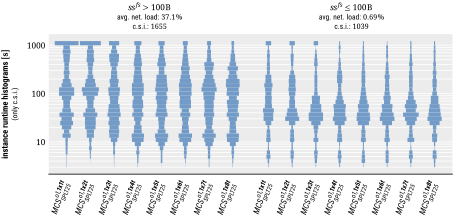|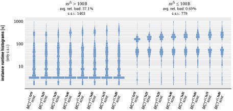|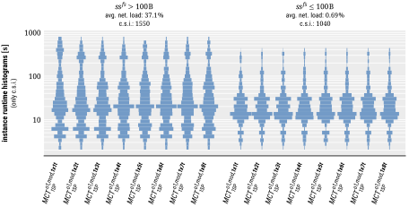|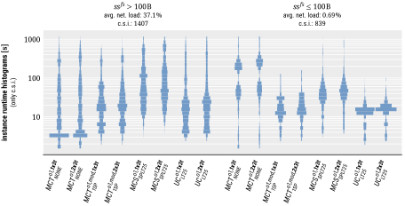|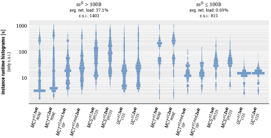|
|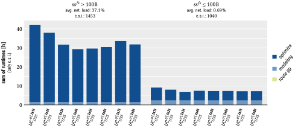|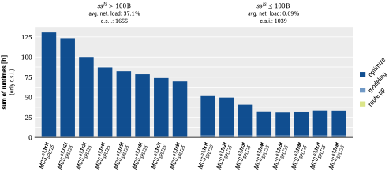|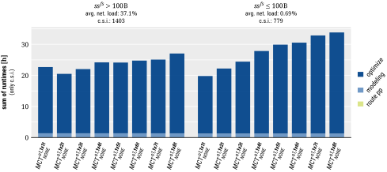|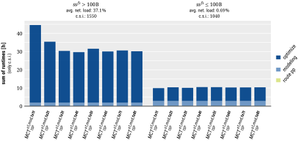|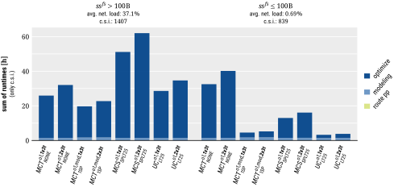||
|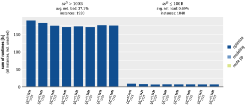|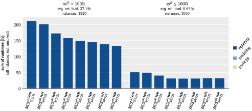|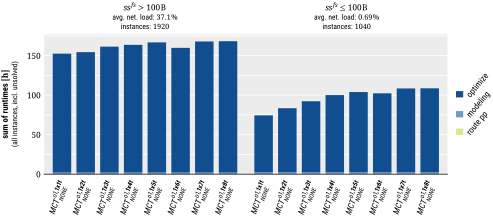|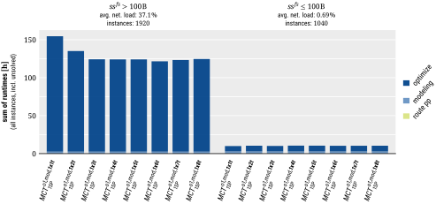|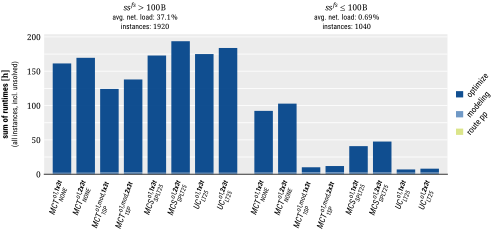|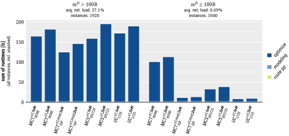|
||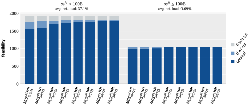||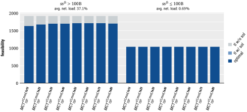||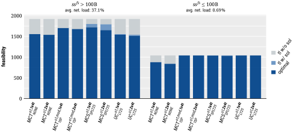|

## hi

|t_uc|t_mcs|t_mct_none|t_mct_1sp|i_3t|i_4t|
|:---:|:---:|:---:|:---:|:---:|:---:|
|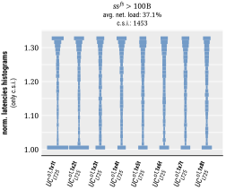|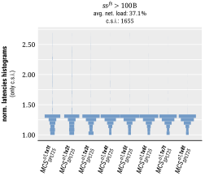|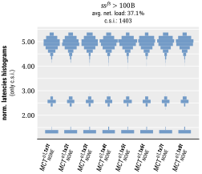|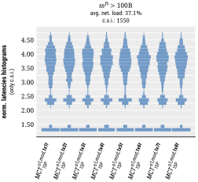||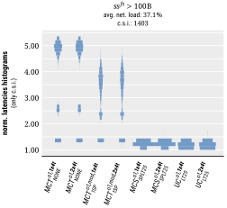|
|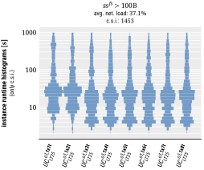|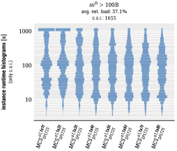|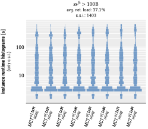|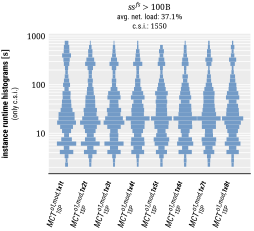|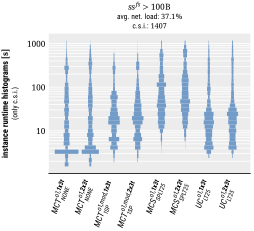|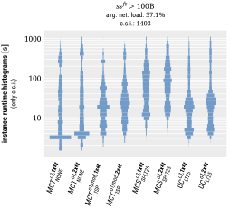|
|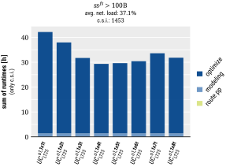|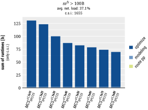|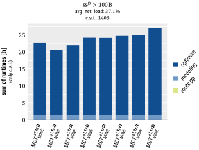|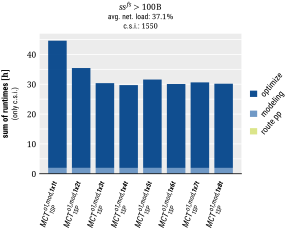|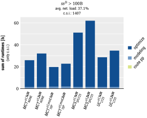|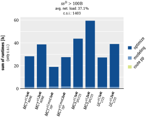|
|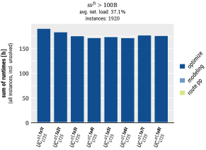|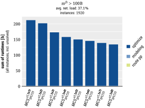|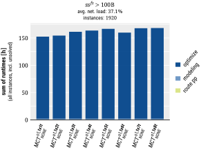|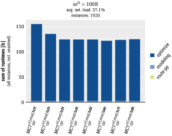|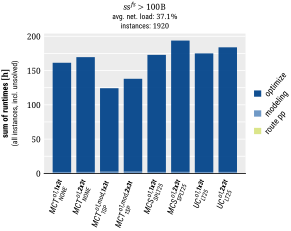||
|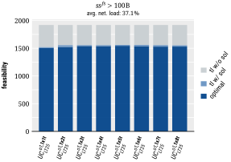|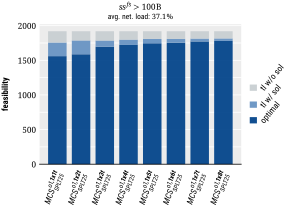|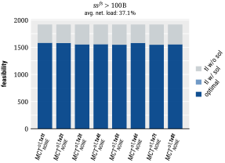||||

## lo

|t_uc|t_mcs|t_mct_none|t_mct_1sp|i_3t|i_4t|
|:---:|:---:|:---:|:---:|:---:|:---:|
|||||||
|||||||
|||||||
|||||||
|||||||

